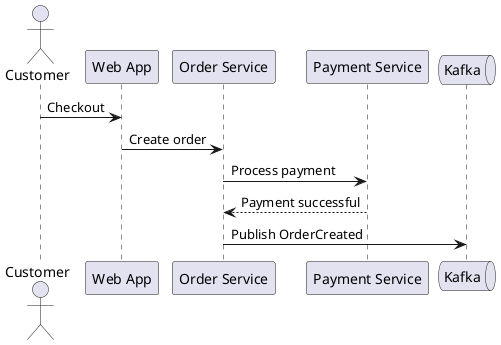
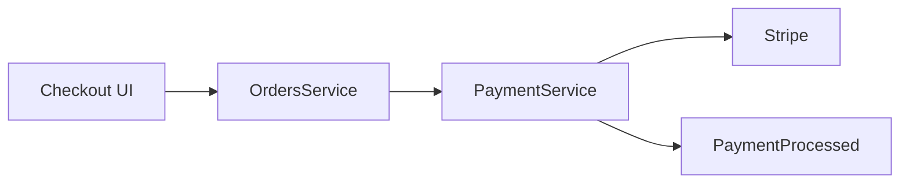

# Diagrams

## Format

**File:** `index.mdx` inside a diagram folder
**Location:** `diagrams/{DiagramName}/index.mdx` or nested under a domain/subdomain, e.g. `domains/{Domain}/diagrams/{DiagramName}/index.mdx`

Diagram resources are reusable, versioned pages for architecture diagrams, sequence diagrams, event storming outputs, system maps, or other visual models.

## Frontmatter Fields

| Field | Required | Description |
|-------|----------|-------------|
| `id` | Yes | Unique identifier, often kebab-case (e.g., `order-flow`) |
| `name` | Yes | Human-readable name |
| `version` | Yes | Semver string (e.g., `1.0.0`) |
| `summary` | Yes | 1-2 sentence description |
| `owners` | No | Array of team or user IDs |
| `badges` | No | Array of badge objects |
| `repository` | No | Object with `language` and `url` |

## Example: PlantUML Diagram

````mdx
---
id: order-flow
name: Order Processing Flow
version: 1.0.0
summary: Sequence diagram showing the complete order processing flow.
---



## Order Processing Flow

This sequence diagram illustrates the checkout path from customer action through event publication.
````

## Example: Mermaid Diagram

````mdx
---
id: payment-context
name: Payment Context Map
version: 1.0.0
summary: Context map for payment processing integrations.
---


````

## Linking Diagrams From Resources

Use the `diagrams` field on related resources:

```yaml
diagrams:
  - id: order-flow
```

Then link in prose:

```markdown
See [[diagram|order-flow]] for the end-to-end order sequence.
```

## Key Conventions

- Prefer reusable diagram resources for diagrams that multiple pages should link to.
- Use inline diagrams inside a service/domain page when the diagram is only useful there.
- Keep diagram IDs stable and version diagrams when architecture changes materially.
- Use fenced `mermaid` or `plantuml` blocks for diagram content.
