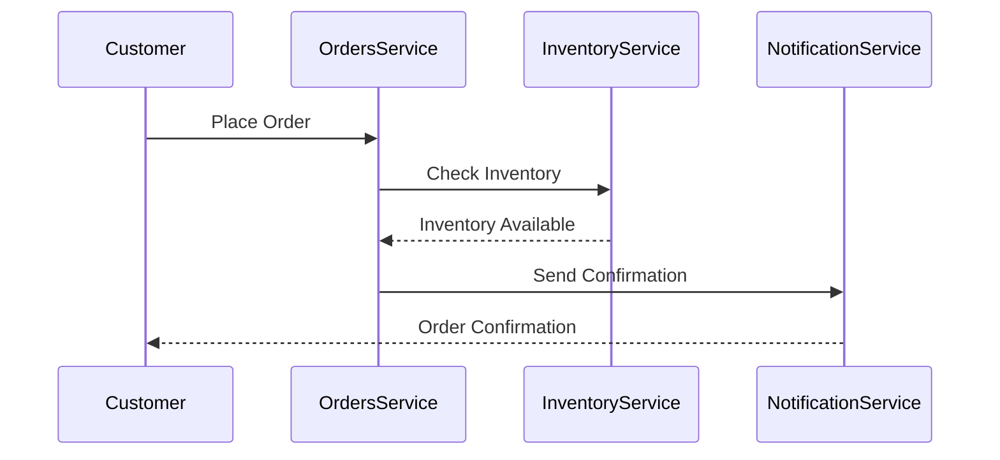

# EventCatalog Documentation Best Practices

Comprehensive guide for writing high-quality MDX documentation in EventCatalog. Contains 16 rules across 4 categories, prioritized by impact.

## When to Apply

Reference these guidelines when:
- Creating documentation for new events, services, domains, or other resources
- Reviewing existing documentation for best practices
- Adding cross-references between resources
- Including visual components like diagrams and schemas

## Rule Categories by Priority

| Priority | Category | Impact | Prefix |
|----------|----------|--------|--------|
| 1 | Frontmatter Structure | CRITICAL | `frontmatter-` |
| 2 | Content Structure | HIGH | `content-` |
| 3 | Documentation Quality | MEDIUM | `quality-` |
| 4 | Metadata & Organization | MEDIUM | `metadata-` |

## Quick Reference

### 1. Frontmatter Structure (CRITICAL)

- `frontmatter-required-fields` - Include id, name, and version in all resources
- `frontmatter-summary` - Always provide a meaningful summary
- `frontmatter-owners` - Assign owners to every resource
- `frontmatter-version-format` - Use semantic versioning

### 2. Content Structure (HIGH)

- `content-overview-section` - Start with an Overview section
- `content-cross-references` - Use wiki-style links for cross-references
- `content-visual-components` - Include NodeGraph for architecture visualization
- `content-code-examples` - Provide code examples with proper formatting

### 3. Documentation Quality (MEDIUM)

- `quality-mermaid-diagrams` - Use Mermaid for sequence and architecture diagrams
- `quality-tiles-navigation` - Use Tiles for key navigation links
- `quality-steps-component` - Use Steps for procedural instructions
- `quality-schema-viewer` - Include SchemaViewer for message schemas

### 4. Metadata & Organization (MEDIUM)

- `metadata-badges` - Use badges for status and categorization
- `metadata-deprecation` - Document deprecation with dates and migration paths
- `metadata-draft-mode` - Use draft mode for work-in-progress documentation
- `metadata-repository-link` - Link to source code repositories

---

## Detailed Rules

### frontmatter-required-fields
**Impact:** CRITICAL
**Category:** Frontmatter Structure

Every EventCatalog resource must include `id`, `name`, and `version` fields in frontmatter. The `id` is used for references and URL generation.

**Good:**
```yaml
---
id: OrderConfirmed
name: Order Confirmed
version: 1.0.0
summary: Indicates that an order has been successfully confirmed
owners:
  - order-team
---
```

**Bad:**
```yaml
---
name: Order Confirmed
# Missing id and version - resource won't be properly indexed
---
```

### frontmatter-summary
**Impact:** CRITICAL
**Category:** Frontmatter Structure

Always provide a meaningful `summary` field that describes the resource's purpose. Summaries appear in search results, lists, and hover previews.

**Good:**
```yaml
---
id: InventoryService
name: Inventory Service
version: 0.0.2
summary: |
  Service that manages product stock levels, tracks inventory movements,
  and ensures product availability across all warehouses.
---
```

**Bad:**
```yaml
---
id: InventoryService
name: Inventory Service
version: 0.0.2
# Missing summary - users won't understand what this service does
---
```

### frontmatter-owners
**Impact:** CRITICAL
**Category:** Frontmatter Structure

Assign owners to every resource using user or team IDs. Owners are displayed in the UI and enable accountability.

**Good:**
```yaml
---
id: PaymentProcessed
name: Payment Processed
version: 1.0.0
owners:
  - payment-team
  - dboyne
  - msmith
---
```

**Bad:**
```yaml
---
id: PaymentProcessed
name: Payment Processed
version: 1.0.0
# Missing owners - no accountability or contact point
---
```

### frontmatter-version-format
**Impact:** CRITICAL
**Category:** Frontmatter Structure

Use semantic versioning (MAJOR.MINOR.PATCH) for all resources. Version must be a string, not a number.

**Good:**
```yaml
---
id: UserSignedUp
name: User Signed Up
version: "1.0.0"
---
```

**Bad:**
```yaml
---
id: UserSignedUp
name: User Signed Up
version: 1  # Not semantic versioning, also a number not string
---
```

### content-overview-section
**Impact:** HIGH
**Category:** Content Structure

Start every documentation file with an Overview section that explains what the resource does and its role in the system.

**Good:**
```mdx
---
id: InventoryService
name: Inventory Service
version: 0.0.2
---

## Overview

The Inventory Service is a critical component responsible for managing product
stock levels, tracking inventory movements, and ensuring product availability.
It works closely with the [[service|OrdersService]] and is part of the
[[domain|Orders]] domain.

The service receives events like [[event|OrderConfirmed]] and publishes
[[event|InventoryAdjusted]] to notify other services of inventory changes.
```

**Bad:**
```mdx
---
id: InventoryService
name: Inventory Service
version: 0.0.2
---

## API Reference

### getInventory()
Returns current inventory levels...
```

### content-cross-references
**Impact:** HIGH
**Category:** Content Structure

Use wiki-style links `[[type|id]]` to create cross-references between resources. This enables automatic link resolution and relationship tracking.

**Good:**
```mdx
## Overview

The [[service|OrdersService]] publishes this event when an order is confirmed.
It is consumed by the [[service|InventoryService]] and [[service|NotificationService]].

This event is part of the [[domain|Orders]] domain and uses the
[[channel|orders-domain-eventbus]] for routing.
```

**Bad:**
```mdx
## Overview

The OrdersService publishes this event when an order is confirmed.
It is consumed by the InventoryService and NotificationService.

<!-- Plain text references don't create links or track relationships -->
```

### content-visual-components
**Impact:** HIGH
**Category:** Content Structure

Include the `<NodeGraph />` component to automatically visualize architecture and relationships. Place it after the overview section.

**Good:**
```mdx
## Overview

The Inventory Service manages product stock levels and inventory movements.

## Architecture diagram

<NodeGraph />
```

**Bad:**
```mdx
## Overview

The Inventory Service manages product stock levels and inventory movements.

<!-- No visual representation - users must imagine the architecture -->
```

### content-code-examples
**Impact:** HIGH
**Category:** Content Structure

Provide code examples with proper syntax highlighting using fenced code blocks. Use tabs for multiple languages.

**Good:**
```mdx
## Producing the Event

<Tabs>
  <TabItem title="Python">

    ```python title="Produce event in Python"
    from kafka import KafkaProducer
    import json

    producer = KafkaProducer(
        bootstrap_servers=['localhost:9092'],
        value_serializer=lambda v: json.dumps(v).encode('utf-8')
    )

    producer.send('inventory.adjusted', event_data)
    ```
  </TabItem>
  <TabItem title="TypeScript">

    ```typescript title="Produce event in TypeScript"
    import { Kafka } from 'kafkajs';

    const producer = kafka.producer();
    await producer.send({
      topic: 'inventory.adjusted',
      messages: [{ value: JSON.stringify(eventData) }],
    });
    ```
  </TabItem>
</Tabs>
```

**Bad:**
```mdx
## Producing the Event

To produce the event, use the Kafka producer and send to the topic.

<!-- No actual code examples provided -->
```

### quality-mermaid-diagrams
**Impact:** MEDIUM
**Category:** Documentation Quality

Use Mermaid diagrams for sequence diagrams, state diagrams, and architecture visualizations that aren't covered by NodeGraph.

**Good:**
```mdx
### Order processing sequence


```

**Bad:**
```mdx
### Order processing sequence

1. Customer places order
2. OrdersService checks inventory
3. InventoryService confirms availability
4. NotificationService sends confirmation

<!-- Text-only sequence is harder to understand -->
```

### quality-tiles-navigation
**Impact:** MEDIUM
**Category:** Documentation Quality

Use `<Tiles>` and `<Tile>` components to create navigation cards for important links and actions.

**Good:**
```mdx
<Tiles>
    <Tile
        icon="UserGroupIcon"
        href="/docs/teams/full-stack"
        title="Contact the team"
        description="Any questions? Feel free to contact the owners"
    />
    <Tile
        icon="DocumentIcon"
        href={`/docs/services/${frontmatter.id}/${frontmatter.version}/changelog`}
        title="View the changelog"
        description="Want to know the history? View the change logs"
    />
    <Tile
        icon="BoltIcon"
        href={`/visualiser/services/${frontmatter.id}/${frontmatter.version}`}
        title={`Sends ${frontmatter.sends.length} messages`}
        description="This service sends messages to downstream consumers"
    />
</Tiles>
```

**Bad:**
```mdx
## Links

- [Contact the team](/docs/teams/full-stack)
- [View the changelog](/docs/services/InventoryService/0.0.2/changelog)

<!-- Plain links are less visually appealing and harder to scan -->
```

### quality-steps-component
**Impact:** MEDIUM
**Category:** Documentation Quality

Use the `<Steps>` component for procedural instructions like setup guides, integration steps, or workflows.

**Good:**
```mdx
<Steps title="How to connect to Inventory Service">
  <Step title="Obtain API credentials">
    Request API credentials from the Inventory Service team.
  </Step>
  <Step title="Install the SDK">
    Run the following command in your project directory:
    ```bash
    npm install inventory-service-sdk
    ```
  </Step>
  <Step title="Initialize the client">
    Use the following code to initialize the client:
    ```js
    const client = new InventoryService.Client({
      clientId: 'YOUR_CLIENT_ID',
      clientSecret: 'YOUR_CLIENT_SECRET'
    });
    ```
  </Step>
</Steps>
```

**Bad:**
```mdx
## How to connect

1. Get credentials
2. Install SDK
3. Initialize client

<!-- Numbered list is less visually clear for multi-step processes -->
```

### quality-schema-viewer
**Impact:** MEDIUM
**Category:** Documentation Quality

Use `<SchemaViewer>` to display message schemas with proper formatting. Include both the interactive viewer and raw schema.

**Good:**
```mdx
## Schema

<SchemaViewer file="schema.json" title="Order Confirmed Schema" maxHeight="500" />

### Raw Schema

<Schema file="schema.json" title="Order Confirmed Schema (JSON)" />
```

**Bad:**
```mdx
## Schema

The event has fields: orderId, customerId, totalAmount, items.

<!-- No actual schema display - users can't see field types or structure -->
```

### metadata-badges
**Impact:** MEDIUM
**Category:** Metadata & Organization

Use badges to indicate status, technology, or categorization. Include background color and optional icons.

**Good:**
```yaml
---
id: InventoryAdjusted
name: Inventory Adjusted
version: 1.0.1
badges:
  - content: Recently updated!
    backgroundColor: green
    textColor: green
  - content: "Broker: Apache Kafka"
    backgroundColor: yellow
    textColor: yellow
    icon: kafka
  - content: "Priority: High"
    backgroundColor: red
    textColor: red
---
```

**Bad:**
```yaml
---
id: InventoryAdjusted
name: Inventory Adjusted
version: 1.0.1
# No badges - users can't quickly see important status info
---
```

### metadata-deprecation
**Impact:** MEDIUM
**Category:** Metadata & Organization

When deprecating resources, include a date and detailed message with migration instructions.

**Good:**
```yaml
---
id: InventoryService
name: Inventory Service
version: 0.0.1
deprecated:
  date: 2026-05-01T00:00:00.000Z
  message: |
    This service is **being deprecated** and replaced by the new service
    **InventoryServiceV2**.

    Please contact the [team for more information](mailto:inventory-team@example.com)
    or visit our [migration guide](/docs/migration/inventory-v2).
---
```

**Bad:**
```yaml
---
id: InventoryService
name: Inventory Service
version: 0.0.1
deprecated: true
# No date or migration instructions
---
```

### metadata-draft-mode
**Impact:** MEDIUM
**Category:** Metadata & Organization

Use draft mode for work-in-progress documentation. Include a title and detailed message explaining the draft status.

**Good:**
```yaml
---
id: InventoryAdjusted
name: Inventory Adjusted
version: 2.0.0
draft:
  title: Inventory Adjusted 2.0.0 is in draft
  message: |
    ### New version is in draft

    This is a new version of the Inventory Adjusted event. It is not yet
    ready for production. We are collecting feedback from the team.

    You can use this version in lower environments, **but please be aware
    that it may change.**

    Previous stable version: [Inventory Adjusted 1.0.0](/docs/events/InventoryAdjusted/1.0.0)
---
```

**Bad:**
```yaml
---
id: InventoryAdjusted
name: Inventory Adjusted
version: 2.0.0
draft: true
# No context about why it's a draft or what to use instead
---
```

### metadata-repository-link
**Impact:** MEDIUM
**Category:** Metadata & Organization

Link services to their source code repositories. Include the primary language.

**Good:**
```yaml
---
id: InventoryService
name: Inventory Service
version: 0.0.2
repository:
  language: JavaScript
  url: "https://github.com/event-catalog/inventory-service"
---
```

**Bad:**
```yaml
---
id: InventoryService
name: Inventory Service
version: 0.0.2
# No repository link - developers can't find the source code
---
```
